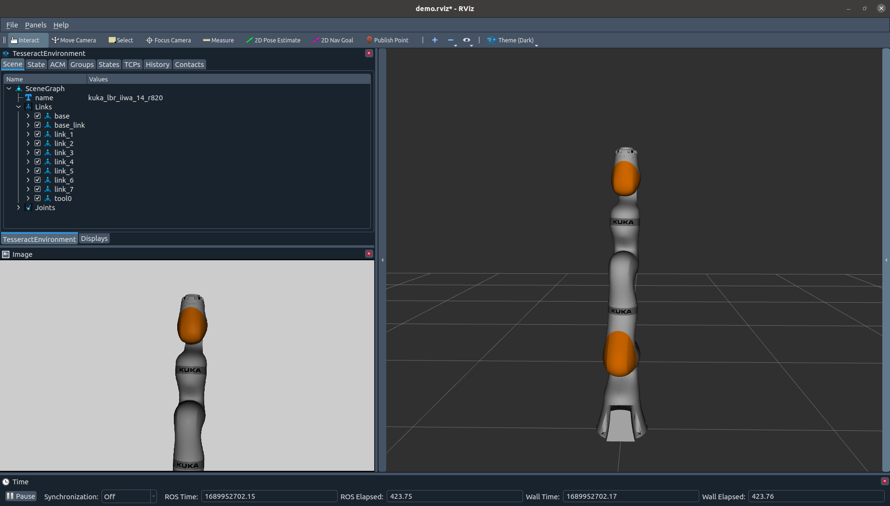

# tesseract_gazebo_ros

This contain functionality to simulate sensors within ROS leveraging Gazebo Sensors.

Below is an example using a RGB camera and be launch by using the following command.

``` bash
roslaunch tesseract_sensor_simulator sensor_simulator_demo.launch
```




## TODO
- Allow loading sensors and lights from Gazebo XML
