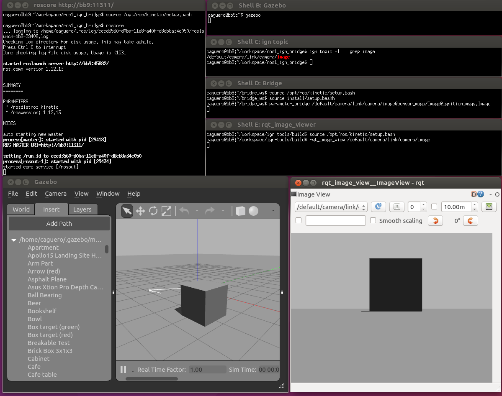

# Bridge communication between ROS and Gazebo Transport

This package provides a network bridge which enables the exchange of messages
between ROS and Gazebo Transport.

The bridge is currently implemented in C++. At this point there's no support for
service calls. Its support is limited to only the following message types:

| ROS type                       | Gazebo Transport type      |
|--------------------------------|:--------------------------:|
| std_msgs/Bool                  | gz::msgs::Boolean          |
| std_msgs/ColorRGBA             | gz::msgs::Color            |
| std_msgs/Empty                 | gz::msgs::Empty            |
| std_msgs/Int32                 | gz::msgs::Int32            |
| std_msgs/Float32               | gz::msgs::Float            |
| std_msgs/Float64               | gz::msgs::Double           |
| std_msgs/Header                | gz::msgs::Header           |
| std_msgs/String                | gz::msgs::StringMsg        |
| geometry_msgs/Quaternion       | gz::msgs::Quaternion       |
| geometry_msgs/Vector3          | gz::msgs::Vector3d         |
| geometry_msgs/Point            | gz::msgs::Vector3d         |
| geometry_msgs/Pose             | gz::msgs::Pose             |
| geometry_msgs/PoseArray        | gz::msgs::Pose_V           |
| geometry_msgs/PoseStamped      | gz::msgs::Pose             |
| geometry_msgs/Transform        | gz::msgs::Pose             |
| geometry_msgs/TransformStamped | gz::msgs::Pose             |
| geometry_msgs/Twist            | gz::msgs::Twist            |
| mav_msgs/Actuators ([not on Noetic](https://github.com/ethz-asl/mav_comm/issues/86)) | gz::msgs::Actuators        |
| nav_msgs/OccupancyGrid         | gz::msgs::OccupancyGrid    |
| nav_msgs/Odometry              | gz::msgs::Odometry         |
| rosgraph_msgs/Clock            | gz::msgs::Clock            |
| sensor_msgs/BatteryState       | gz::msgs::BatteryState     |
| sensor_msgs/CameraInfo         | gz::msgs::CameraInfo       |
| sensor_msgs/FluidPressure      | gz::msgs::FluidPressure    |
| sensor_msgs/Imu                | gz::msgs::IMU              |
| sensor_msgs/Image              | gz::msgs::Image            |
| sensor_msgs/JointState         | gz::msgs::Model            |
| sensor_msgs/LaserScan          | gz::msgs::LaserScan        |
| sensor_msgs/MagneticField      | gz::msgs::Magnetometer     |
| sensor_msgs/NavSatFix          | gz::msgs::NavSat           |
| sensor_msgs/PointCloud2        | gz::msgs::PointCloudPacked |
| tf_msgs/TFMessage              | gz::msgs::Pose_V           |
| visualization_msgs/Marker      | gz::msgs::Marker           |
| visualization_msgs/MarkerArray | gz::msgs::Marker_V         |

Run `rosmaster & rosrun ros_gz_bridge parameter_bridge -h` for instructions.

## Example 1a: Gazebo Transport talker and ROS listener

First we start a ROS `roscore`:

```
# Shell A:
. /opt/ros/noetic/setup.bash
roscore
```

Then we start the parameter bridge which will watch the specified topics.

```
# Shell B:
. ~/bridge_ws/install/setup.bash
rosrun ros_gz_bridge parameter_bridge /chatter@std_msgs/String@gz.msgs.StringMsg
```

Now we start the ROS listener.

```
# Shell C:
. /opt/ros/noetic/setup.bash
rostopic echo /chatter
```

Now we start the Gazebo Transport talker.

```
# Shell D:
gz topic -t /chatter -m gz.msgs.StringMsg -p 'data:"Hello"'
```

## Example 1b: ROS talker and Gazebo Transport listener

First we start a ROS `roscore`:

```
# Shell A:
. /opt/ros/noetic/setup.bash
roscore
```

Then we start the parameter bridge which will watch the specified topics.

```
# Shell B:
. ~/bridge_ws/install/setup.bash
rosrun ros_ign_bridge parameter_bridge /chatter@std_msgs/String@gz.msgs.StringMsg
```

Now we start the Gazebo Transport listener.

```
# Shell C:
gz topic -e -t /chatter
```

Now we start the ROS talker.

```
# Shell D:
. /opt/ros/noetic/setup.bash
rostopic pub /chatter std_msgs/String "data: 'Hi'" --once
```

## Example 2: Run the bridge and exchange images

In this example, we're going to generate Gazebo Transport images using Gazebo
classic, that will be converted into ROS images, and visualized with `rqt_viewer`.

First we start a ROS `roscore`:

```
# Shell A:
. /opt/ros/noetic/setup.bash
roscore
```

Then we start Gazebo.

```
# Shell B:
gazebo
```

Once Gazebo is running, click on the `Insert` tab, and then, insert a `Camera`
object into the scene. Now, let's see the topic where the camera images are
published.

```
# Shell C:
gz topic -l | grep image
/default/camera/link/camera/image
```

Then we start the parameter bridge with the previous topic.

```
# Shell D:
. ~/bridge_ws/install/setup.bash
rosrun ros_ign_bridge parameter_bridge /default/camera/link/camera/image@sensor_msgs/Image@gz.msgs.Image
```

Now we start the ROS GUI:

```
# Shell E:
. /opt/ros/noetic/setup.bash
rqt_image_view /default/camera/link/camera/image
```

You should see the current images in `rqt_image_view` which are coming from
Gazebo (published as Gazebo Msgs over Gazebo Transport).

The screenshot shows all the shell windows and their expected content
(it was taken using ROS Kinetic):


